中文 | [English](README_en.md)

# Zotero AI Workflow

Zotero AI Workflow 是一套用于 Zotero 文献阅读与笔记管理的自动化工具集。
项目将 Zotero 插件、Python 服务和 LLM API 组合在一起，支持：

- AI 论文摘要
- 库级与 PDF 级问答
- 标注转结构化笔记
- 笔记导出与外部同步

核心架构：某种行为(入库/打开/关闭/右键菜单) -> start_script.js 事件监控 -> 路由执行对应脚本 -> 访问python后台/调用zotero-better-notes模板/调用LLM API等 -> 写回笔记

本库适合：期望自己动手搭建灵活的zotero工作流的用户。

界面化的插件可以使用zotero-AI-Butler

## zotero工作流概览

一个常见流程如下：

- 文献入库
  - 自动：添加 To-Read 等标签
  - 手动：补充项目标签
- 打开文献
  - 自动：生成 AI 摘要并写入笔记
- 阅读文献
  - 手动：添加 PDF 标注
  - 交互：向 LLM 提问并将答案写入笔记
- 关闭文献或周期维护
  - 自动：根据标注生成或更新结构化笔记
  - 自动：导出笔记用于外部同步

## 事件路由总览



> **实时生效**：`config.json` 和各个行为脚本每次触发时实时读取，修改后无需重新打包 XPI 或重启 Zotero。

## 环境与插件

必需组件：

- Zotero
- [zotero-better-notes](https://github.com/windingwind/zotero-better-notes) 
- Python 3.10+
- `pip install .` 安装各种依赖（含 Python 依赖）
- 如需安装 Zotero 插件：需 `zip` 命令（通常系统自带）

> **不再依赖 zotero-actions-tags。** 本项目的 `start_script.js` 已内置事件监控能力，直接监听 Zotero 的 item/tab 事件并路由执行对应脚本。
> 可通过安装 `zotero-ai-flow.xpi` 插件实现 Zotero 启动时自动加载，脚本目录等路径配置在 Zotero 偏好设置中修改（编辑 → 设置 → 插件设置），无需重新打包。

## 快速开始

1. 创建并填写配置文件：

```bash
cp config_example.json config.json
```

必填字段：`server.url`、`llm.openaiBaseUrl`、`llm.modelName`、`llm.apiKey`。
事件触发配置见 `zotero_events` 段，右键菜单配置见 `zotero_events.manual_triggers`。

2. 安装 Zotero 插件（推荐方式，Zotero 启动自动加载）：

```bash
bash scripts/build_xpi.sh
```

打包完成后将 `zotero-ai-flow.xpi` 拖入 Zotero → 工具 → 插件 → 齿轮 → Install Add-on From File。
安装后插件会自动将内置脚本和 `config.json` 解压到 Zotero 配置目录下的
`zotero-ai-flow/` 文件夹，路径偏好自动配置完成。
如需手动修改，打开 **编辑 → 设置 → 插件设置 → Zotero AI Flow**：

| 偏好项 | 说明 |
|--------|------|
| `script_dir` | 行为脚本所在目录（默认自动解压目录） |
| `config_path` | config.json 绝对路径（默认自动解压目录/config.json） |
| `debug` | 是否在 Error Console 输出调试日志 |

修改后即时生效，无需重启或重新打包 XPI。

> 备用方式：不安装插件，通过「工具 → 开发者 → Run JavaScript」手动加载 `start_script.js`（每次启动 Zotero 后需重新加载）。

3. 启动解析服务：

```bash
nohup python parse_server.py > parse_server.log 2>&1 &
```
可写入 bash_profile 实现开机自启。

4. 在 better-notes 中加载笔记模板（`zotero_note_templates/` 目录下）。

5. 按你的流程在 Zotero 中触发对应脚本。

## 配置说明

主配置文件：config.json

- server.url：PDF 解析与 markdown 转 HTML 的后端服务地址
- server.timeout：请求超时时间（秒）
- llm.openaiBaseUrl：兼容 OpenAI 的 API 地址
- llm.modelName：模型名称
- llm.apiKey：模型接口密钥
- llm.temperature：生成温度
- zotero_events.triggers：各事件 (ui_startup / item_open / item_close / item_add) 对应的脚本列表
- zotero_events.debounce_ms：各事件去抖间隔（毫秒）
- zotero_events.manual_triggers.menus：右键菜单项，每项包含 label（菜单文字）和 script（脚本文件名）
- zotero_events.script_dir：脚本目录 fallback（优先从插件偏好读取；安装插件后自动指向 Zotero 配置目录）
- summary.chunkSize：map-reduce 分片大小
- summary.chunkOverlap：相邻分片重叠长度
- summary.maxChunk：最大分片数量
- summary.only_link_file：若使用 Link to File 流程（如 ZotMoov/ZotFile），请设为 true
- summary.support_item_types：支持生成摘要的条目类型
- qa.saveColelctionKey：问答结果保存到的 collection key（保持现有命名以兼容当前脚本）

提示词模板位于 prompt/ 目录：

- stuff_prompt.txt：单分片摘要
- map_prompt.txt：多分片摘要的 map 阶段
- reduce_prompt.txt：多分片摘要的 reduce 阶段
- qa_prompt.txt：问答提示词

### 插件偏好设置（Zotero → 编辑 → 设置 → 插件设置）

以下配置不受 `config.json` 管控，存储在 Zotero 内部偏好系统中（也可在 about:config 中搜索 `extensions.zotero-ai-flow.xiahong.me` 查看）：

| 偏好键 | 说明 | 默认值 |
|--------|------|--------|
| `script_dir` | 行为脚本所在目录的绝对路径 | 打包时的路径 |
| `config_path` | config.json 的绝对路径 | 打包时的路径 |
| `debug` | 调试日志开关 | true |

路径类配置修改后立即生效，无须重新打包 XPI 或重启 Zotero。

## 功能：pdf标注转结构化笔记

相关文件：

- 模板 zotero_note_templates/zotero_note_template.js
- 行为脚本 zotero_actions/zotero_autoupdate_note.js（通过 start_script.js 在 ui_startup / item_close 时自动触发）

该功能在 Zotero 原生标注转笔记能力上增加了层级结构支持。
当前方案通过颜色标注标记标题层级，从而生成结构化笔记。


## 功能：AI 摘要

相关文件：

- zotero_actions/zotero_pdf_summary.js（通过 start_script.js 在 item_open 时自动触发）

流程：

1. 获取选中文献的 PDF 和元信息
2. 将 PDF 发送到 parse_server.py 进行解析与分片
3. 调用 LLM 执行摘要（stuff 或 map-reduce）
4. 将 markdown 转为 HTML
5. 写回 Zotero 笔记


## 功能：语义问答

相关文件：

- zotero_actions/zotero_qa_simple.js
- zotero_actions/zotero_qa.js

语义问答目前支持两种模式：
1. 简单问答：将问题和选中相关内容直接发送给 LLM，获取答案。问题对象可能是：选中的文献、选中的PDF片段。
2. RAG问答：先检索相关内容，再将问题和检索结果发送给 LLM，获取答案。
检索手段包括：互联网检索，zotero库检索，文献片段语义检索等。

问答模式：

- 库级问答：检索相关条目，结合元信息和已有摘要后调用 LLM
- PDF 级问答：检索相关 PDF 片段后带上下文调用 LLM

## 功能：笔记导出与同步

相关文件：

- zotero_actions/zotero_export_note.js

导出后可在外部笔记系统中进行检索与复用。
可按你的工作流在脚本或配置中指定目标 key。


## 核心脚本索引

| 目录 | 脚本文件 | 作用 |
|------|----------|------|
| 根目录 | parse_server.py | PDF 解析与 markdown 转 HTML 的后端服务 |
| 根目录 | paper_summary.py | 论文摘要生成（map-reduce） |
| 根目录 | build_zotero_es_index.py | 构建 Elasticsearch 索引 |
| 根目录 | run_zotero_qa.py | 运行问答系统测试入口 |
| zotero_actions/ | start_script.js | **事件监控入口**：监听 Zotero 事件并路由执行对应脚本，支持右键菜单手动触发（替代 zotero-actions-tags） |
| zotero_actions/ | zotero_pdf_summary.js | AI 论文摘要（获取 PDF → 解析 → LLM → 写回笔记） |
| zotero_actions/ | zotero_autoupdate_note.js | 标注转结构化笔记（颜色层级、自动更新） |
| zotero_actions/ | zotero_qa.js | 语义问答（RAG 检索 + LLM 回答） |
| zotero_actions/ | zotero_qa_simple.js | 简单问答（直接 LLM 问答） |
| zotero_actions/ | zotero_llm_qa.js | 基于 LLM 的问答交互 |
| zotero_actions/ | zotero_export_note.js | 笔记导出用于外部同步 |
| zotero_note_templates/ | zotero_note_template.js | 结构化笔记模板（颜色标记层级） |
| zotero_note_templates/ | zotero_merge_annoattaion_summary.js | 合并标注与 AI 摘要到笔记,暂时无用 |
| zotero_note_templates/ | zotero_note_template_mergeai.js | 合并 AI 摘要的笔记模板,暂时无用 |
| zotero_qa/ | main.py | QA 系统主模块 |
| zotero_qa/ | qa_agents.py | 问答 Agent（多智能体协作） |
| zotero_qa/ | search_es.py | Elasticsearch 语义检索 |
| zotero_qa/ | search_tools.py | 检索工具集（互联网/Zotero/语义） |
| zotero_qa/ | aliyun_embedding.py | 阿里云 Embedding 接口 |
| zotero_qa/ | document_splitter.py | 文档分片工具 |
| zotero_qa/ | zotero_search.py | Zotero 库检索接口 |
| zotero_plugin/ | install.rdf + bootstrap.js | Zotero 插件（启动时自动加载 start_script.js） |
| zotero_plugin/ | defaults/preferences/zotero-ai-flow.js | 插件默认偏好值（script_dir / config_path / debug） |
| scripts/ | build_xpi.sh | XPI 打包脚本 |
| scripts/ | generate_mermaid_svg.py | Mermaid → SVG/PNG 图片生成 |
